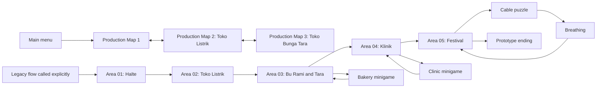

# Before The Streetlights - Living GDD and AI Agent Handoff

Last updated: 2026-07-12  
Project root: `C:\Users\Zaki\Gamedev\Gemastik\BeforeTheStreetLights`  
Engine: Godot 4.6.2  
Language: GDScript  
Dialogue addon: Dialogic 2 Alpha 19, vendored in `addons/dialogic/`  
Target platform: Windows PC, exported as `.exe`

## 1. Purpose of This Document

This is the primary handoff document for any new human or agentic AI working on the project. It combines:

- The original story and GDD from the team PDFs.
- Decisions made during implementation and debugging.
- The current repository architecture and gameplay flow.
- The current state of the polished Map 1 prototype.
- Known gaps, risks, and the next recommended work.

Read this document before editing the project. Do not assume that the old five-area prototype and the newer Map 1 production prototype are already the same system. They currently coexist and serve different purposes.

## 2. Source of Truth and Priority

When sources disagree, use this priority:

1. The user's latest explicit instruction.
2. The current working tree and current Godot scene values.
3. This living handoff document.
4. The original GDD and proposal PDFs.
5. Older placeholder scenes, comments, and README text.

Original source documents:

- `C:\Users\Zaki\Downloads\GEMASTIK GAMEDEV KAMI MAU GAJI DOLAR.pdf`
- `C:\Users\Zaki\Downloads\Proposal Before the Streetlights.pdf`

Important working rule: the Git worktree may be dirty because the user edits scenes manually in Godot. Never reset, revert, or overwrite user-authored scene transforms. Read the diff first and work with it.

## 3. Game Identity

### Title

**Before The Streetlights**

### High Concept

Before The Streetlights is a short 2D narrative side-scrolling adventure about Nara, a young anthropomorphic civet who returns to Kota Ranting after disappearing from friends and family while experiencing burnout in a large city. During one afternoon and evening, Nara helps prepare the annual Festival Lampu Jalan while reconnecting with old friends, helping residents, and slowly admitting that being exhausted is not a personal failure.

The game is not about instantly curing Nara. The emotional resolution is a small but realistic step: Nara admits being tired, accepts that other people can remain present, and keeps a mental-health support card instead of throwing it away.

### Genre and Scope

- Narrative adventure.
- 2D side-scrolling exploration.
- Slice of life and emotional story game.
- Light platforming, conversations, object comments, and short minigames.
- No combat.
- No punishing game-over loop.
- Target playtime from the GDD: approximately 30 minutes.
- Team scope from the proposal: three people, one programmer and two artists.

### Theme and SDG Context

The project addresses SDG 3: Good Health and Well-being, especially:

- Burnout and academic or productivity pressure.
- Crashout and emotional overload.
- Isolation and avoidance.
- The social impact of disappearing from people who care.
- Rest as a necessary part of continuing, not as defeat.
- Mental health as part of health, not separate from physical health.
- Asking for and accepting help without presenting an instant cure.

Core message:

> Berhenti sebentar bukan berarti padam. Kadang itu satu-satunya cara agar kita bisa menyala lagi.

## 4. Design Pillars

### 4.1 Cozy Surface, Heavy Core

The first impression is warm, funny, and calm: a small Indonesian town, old shops, food, streetlights, power cables, residents, and a local festival. The deeper layer reveals burnout, loneliness, social pressure, abandoned places, understaffed healthcare, and residents normalizing exhaustion.

### 4.2 Natural Dialogue, Not a Lecture

Dialogue should sound like daily Indonesian conversation. Characters do not recite mental-health theory. Humor, pauses, indirect language, and subtext carry the topic.

Representative tone:

- Nara: "Di sana berhenti sebentar rasanya kayak kalah."
- Bu Rami: "Lho, sejak kapan napas dihitung kalah?"

### 4.3 Kota Ranting Is a Character

The town is not decorative scenery. Closed shops, a tired clinic, tangled cables, old posters, food stalls, flowers, benches, and streetlights communicate its history and current condition.

### 4.4 Gameplay Expresses Emotion

Minigames are short and narratively meaningful. Small tasks become harder when Nara is overwhelmed. The cable puzzle, distortion, and breathing sequence must connect mechanics to Nara's emotional state.

### 4.5 Small, Honest Resolution

Do not end with Nara being completely healed. The ending should show honesty, support, and a willingness to take one next step.

## 5. Narrative Overview

### Premise

Kota Ranting holds the Festival Lampu Jalan every year. Residents reconnect and relight old lamps along the main road so nobody feels that they are returning home alone. Recently the town has become less warm: shops have closed, the clinic lacks staff, young people leave, and tiredness is treated as normal.

Nara returns by taxi in the afternoon. Nara has not replied to chats, calls, or social media for months. Friends expected Nara to succeed at university in the city, but deadlines, expectations, lack of sleep, and fear of disappointing others led to burnout and withdrawal.

### Full Story Flow

#### Chapter 1 - Kota yang Dulu Dikenal

- Nara arrives at the Kota Ranting bus stop by taxi.
- Bimo welcomes Nara loudly and jokingly recruits Nara for festival work.
- The player learns movement, jumping, interaction, and the town's visual language.
- Bimo gives the festival task chain: cable, food, clinic supplies, Tara, then festival.
- The cozy town already contains melancholy details: closed shops, rent signs, and old health posters.

#### Chapter 2 - Bu Rami's Bakery

- Nara meets Bu Rami, an older goat who is sharp, funny, and caring.
- Nara helps serve bakery customers through a cashier simulation: bagging food,
  taking payment, calculating change, and clearing each customer's tray.
- Bu Rami talks about how residents used to sit together when sad, while people now isolate themselves.
- She notices Nara is not eating or sleeping properly.
- She gives extra food because tired people forget hunger.

#### Chapter 3 - Tara

- Nara visits Tara, a white rabbit and former close friend who works at a flower shop.
- Tara is hurt because Nara vanished without replying.
- The conflict is not "Nara should not be tired". It is that Nara decided alone that nobody would listen.
- The player chooses one of several honest responses. Choices change flavor and flags, not the final ending.
- Tara initially refuses or avoids promising to attend the festival, but later comes.

#### Chapter 4 - Kota Mulai Sore

- The town shifts from warm afternoon to orange, then colder purple and blue.
- Nara's movement and perception become heavier.
- Ambient voices become whispers and fragments such as "deadline", "belum selesai", "harusnya kamu bisa", and "jangan ngecewain".
- The world can become black while characters become white silhouettes.
- Bimo notices Nara freezing in the street. Nara deflects with humor and continues toward the clinic.

#### Chapter 5 - Klinik St. Ranting

- Nara meets dr. Seno, an older owl doctor who is calm and nonjudgmental.
- The player helps record patient complaints in a simplified form minigame.
- The clinic shows that residents seek help for physical, mental, and emotional complaints.
- The minigame must not pretend to be a realistic diagnosis simulator.
- Dr. Seno asks about sleep, eating, and compulsive productivity.
- Nara admits that returning home did not leave the exhaustion behind.
- Dr. Seno gives the festival first-aid kit and a mental-health support card.

#### Chapter 6 - Lampu yang Tidak Menyala

- Residents gather at the festival, but the main lights do not turn on.
- Nara connects colored cables in the cable minigame.
- Pressure words, visual darkness, and memories intensify as the puzzle progresses.
- The cable puzzle transitions directly into the breathing minigame.
- The breathing sequence is a pause and grounding symbol, not a cure.
- Afterward Nara says, without a joke: "Aku capek, Bim."
- Bimo does not lecture. He simply asks whether Nara wants to sit down.

#### Chapter 7 - Tara Datang

- Tara arrives with flower decorations.
- Nara apologizes honestly.
- Nara explains that replying to one message felt like having to explain everything, and admitting incapacity felt like disappointing everyone.
- Tara says she was disappointed by the disappearance, not by Nara being tired.
- The relationship is not instantly fixed, but communication begins again.

#### Chapter 8 - Festival Lampu Jalan

- The last cable is connected and the streetlights turn on.
- Bu Rami serves food, Bimo remains energetic, Tara decorates, and dr. Seno watches quietly.
- Nara, Bimo, and Tara sit together without forcing a large conversation.
- Nara keeps dr. Seno's card.
- Final image: the town is warm again, but the solution is companionship and a next step, not a magical cure.

## 6. Character Bible

### Nara

- Species: civet / luwak.
- Role: protagonist and playable character.
- Personality: sarcastic, quick with jokes, outwardly relaxed, inwardly exhausted.
- Defense mechanism: jokes before becoming emotionally honest.
- Internal conflict: believes stopping means failure and fears disappointing people.
- Arc: avoidance -> overload -> honest admission -> accepts support.
- Visual intent: recognizable side silhouette, tired eyes, dark/brown palette, casual worn clothing, small bag.
- Required animation direction: normal idle, tired idle, walk, run, jump/fall, talk, shock, interact, overwhelmed, holding item, sitting.
- Current reality: final/cutout Nara assets exist, but the polished Map 1 test intentionally still uses the dummy male sprite sheet until the user requests replacement.

### Bimo

- Species: brown dog.
- Role: old friend, comic relief, emotional anchor, main quest giver.
- Personality: loud, loyal, spontaneous, energetic, more perceptive than he first appears.
- Emotional function: remains present without forcing advice.
- Visual intent: oversized clothes, cheerful expression, movement more energetic than Nara.
- Current polished Map 1 reality: Bimo also uses the same dummy male sheet temporarily.

### Tara

- Species: white rabbit.
- Role: old friend and primary interpersonal conflict.
- Personality: calm, serious, sensitive, sharp when hurt.
- Important rule: Tara is not an antagonist. Her anger comes from care and abandonment.
- Visual intent: flower shop apron, pastel palette, gentle movement with readable sharp expressions.

### Bu Rami

- Species: older goat.
- Role: bakery owner and warm town elder.
- Personality: talkative, observant, funny, direct, caring.
- Narrative function: introduces rest and nourishment naturally without lecturing.

### dr. Seno

- Species: older owl.
- Role: clinic doctor and emotional mentor.
- Personality: calm, observant, nonjudgmental.
- Important rule: asks questions and offers resources; does not deliver an instant cure.

### Supporting NPCs

- Electricity shopkeeper.
- Clinic nurse and patients.
- Festival residents.
- Additional walking/talking animal residents during polishing.

## 7. Core Gameplay

Core loop:

```text
Explore -> Talk -> Help -> Minigame -> Story reveal -> Emotional shift -> Continue
```

Player activities:

- Walk left and right.
- Run.
- Make small jumps.
- Follow a mostly linear world with light verticality.
- Interact with NPCs and environmental objects.
- Read short Nara comments in overhead dialogue bubbles.
- Collect quest items.
- Complete four short minigames.
- Make limited dialogue choices that change tone, not the major ending.

Accessibility and difficulty principles:

- No combat.
- No heavy fail state.
- Wrong minigame input should produce feedback and allow retry.
- The player should always understand the next destination.
- Backtracking should remain minimal, but implemented area entrances allow returning to the previous map.

## 8. Controls

Current project inputs:

| Input | Function |
|---|---|
| `A` / Left Arrow | Move left |
| `D` / Right Arrow | Move right |
| `Shift` | Run |
| `Space` or `W` | Jump in world |
| `E` | Interact with NPC or object |
| `Enter` or `Space` | Advance Dialogic dialogue |
| Mouse / keyboard | Dialogue choice and minigames |
| `Space` hold/release | Breathing minigame |
| `Esc` | Pause or close UI |

The GDD mentions optional controller support, but this has not been completed or validated.

## 9. World and Level Structure

### Narrative Location Order

1. Taxi stop / halte.
2. Main street.
3. Electricity shop.
4. Bu Rami's bakery.
5. Tara's flower shop.
6. Main street emotional overload.
7. Klinik St. Ranting.
8. Festival park.
9. Ending under the streetlights.

### Integrated Five-Area Vertical Slice

The legacy vertical slice condenses the locations into five area scenes:

| Area ID | Scene | Purpose |
|---|---|---|
| `area_01_arrival` | `scenes/areas/area_01_arrival.tscn` | Halte and Bimo introduction |
| `area_02_electric` | `scenes/areas/area_02_electric_street.tscn` | Electricity shop and cable |
| `area_03_shops` | `scenes/areas/area_03_bakery_flower.tscn` | Bu Rami, bakery minigame, Tara choice |
| `area_04_clinic` | `scenes/areas/area_04_clinic_hill.tscn` | Clinic minigame and support card |
| `area_05_festival` | `scenes/areas/area_05_festival_park.tscn` | Cable, breathing, epilogue, ending |

Area transitions at map edges are automatic. Left and right entry sides are preserved so the player can return through the same entrance. `MapBoundaries` prevent the CharacterBody2D player from leaving an area.

### Important: Production Main Flow and Legacy Vertical Slice

The repository currently contains two parallel implementations:

1. **Production main flow** starts at `scenes/new_maps/map1/map1_layering_test.tscn`. Since 2026-07-12, `GameFlow.start_new_game()` routes the menu Start button directly to this scene. Map 1 now connects bidirectionally to production Map 2 through automatic edge transitions. These maps use the newest art, curved track movement, layered foreground, shader, and camera work.
2. **Legacy vertical slice** remains in `scenes/areas/`. It is still playable and tested when called explicitly, and it contains the old full quest/minigame path from Area 1 to the prototype ending.

Do not delete either implementation. New production maps should gradually replace the legacy route while preserving useful `GameFlow`, Dialogic, minigame, loading, and quest systems. The menu must continue to start at production Map 1.

## 10. Quest and State Flow

Main quest: help prepare the Festival Lampu Jalan.

Integrated objective sequence:

1. Meet Bimo: sets `met_bimo`.
2. Collect cable: sets `cable_collected`, adds cable inventory.
3. Complete bakery: sets `minigame_bakery_complete`, adds `Kardus makanan`.
4. Talk to Tara: sets `tara_invited` plus one flavor choice flag.
5. Complete clinic: sets `minigame_clinic_complete`, adds `Kotak P3K` and `Kartu bantuan`.
6. Complete cable puzzle: sets `minigame_cable_complete` and `festival_lights_connected`.
7. Complete breathing: sets `minigame_breathing_complete` and `nara_breathed`.
8. Run `festival_epilogue` and show the ending.

Relevant autoload: `scripts/core/game_flow.gd`.

`GameFlow` owns:

- Quest flags.
- Inventory.
- Current and return area IDs.
- Objective text.
- Area entry side.
- Loading transitions.
- Minigame return position and facing.
- Pending post-minigame dialogue.

Important fixed behavior: entering a minigame captures the player's exact world position and facing. Completing the minigame restores that position instead of blinking back to the map spawn.

## 11. Minigames

Each minigame is a separate scene under `scenes/minigames/`.

### Bakery Orders

- Scene: `scenes/minigames/bakery_orders.tscn`
- Script: `scripts/minigames/bakery_orders.gd`
- Mechanic: serve three customers from a first-person cashier view. Click every
  snack on the tray, close the bag, take the customer's cash, then select the
  correct change from Rp10.000, Rp5.000, Rp2.000, and Rp1.000 notes.
- The cash drawer includes one-step undo. Excess change prompts a customer
  comment and can be corrected without a hard fail state.
- Bakery prices: lemper Rp4.000, pastel Rp7.000, onde-onde Rp5.000, kue lapis
  Rp2.000, donat kentang Rp5.000, dadar gulung Rp3.000, kue lupis Rp8.000,
  muffin stroberi Rp12.000, and kue lumpur Rp6.000.
- After exact change, the customer takes the bag and exits. The empty tray must
  be cleared before the next customer enters.
- Two customer silhouettes are present during service: the active customer and
  a dimmed customer waiting behind them. Head and body idle motion use separate
  timing so the silhouettes do not move as one rigid shape.
- No hard fail state.
- Completion returns to the exact prior map position and starts `bu_rami_after`.

### Clinic Form

- Scene: `scenes/minigames/clinic_form.tscn`
- Script: `scripts/minigames/clinic_form.gd`
- Mechanic: read three patient statements, select complaint type, duration, and mentioned symptoms.
- It records information; it does not diagnose.
- Completion returns to the exact prior position and starts `dr_seno_after`.

### Cable Puzzle

- Scene: `scenes/minigames/cable_puzzle.tscn`
- Script: `scripts/minigames/cable_puzzle.gd`
- Mechanic: connect red, green, and blue plugs to matching sockets.
- Pressure overlay and thought words intensify with progress.
- Completing all three transitions directly to the breathing scene.

### Breathing

- Scene: `scenes/minigames/breathing.tscn`
- Script: `scripts/minigames/breathing.gd`
- Mechanic: hold Space while the circle expands, release while it contracts.
- Three cycles, with forgiving retries and no game over.
- Completion returns to the festival and changes its lighting state.

## 12. Dialogue System

### Direction

- Dialogue appears as overhead speech bubbles near the speaking character, not as a traditional bottom textbox.
- Bubble style is inspired by the presentation rhythm of Night in the Woods but must remain an original implementation and asset set.
- Text uses `PatrickHandSC-Regular.ttf`.
- Bubble body has a subtle animated wobble.
- Bubble tails must remain crisp and smooth, not visibly pixelated or blurry.
- Text reveal is typewriter-like.
- Dialogues should remain natural, funny when appropriate, and emotionally restrained.

### Implementation

- Addon: `addons/dialogic/`.
- Autoload integration: `scripts/core/dialogue_bridge.gd`.
- Characters: `dialogic/characters/*.dch`.
- Timelines: `dialogic/timelines/*.dtl`.
- Style: `dialogic/styles/streetlights_style.tres`.
- Default letter speed: `0.028` seconds.
- Speaker anchors use groups such as `dialogue_nara`, `dialogue_bimo`, and `dialogue_tara`.
- In Map 1, `NaraDialogueAnchor` is a child of the player's `VisualPivot` at local position `(0, -260)`. This makes the bubble follow Nara on slopes, jumps, and one-way platforms. Tune this single head anchor when the character size changes; do not add per-interaction bubble offsets.

`DialogueBridge` also:

- Locks and restores player controls.
- Registers bubble anchors.
- Selects repeat timelines after completion.
- Applies flags, inventory, or minigame follow-up.
- Handles animation signals such as `shock`, `holding_item`, `overwhelmed`, and `sitting`.
- Stores Tara choice flavor flags.

Current timelines include Bimo, electricity shopkeeper, Bu Rami, Tara, dr. Seno, festival epilogue, Map 1 poster, and Map 1 closed shop comments.

Known narrative text inconsistency: `bimo_intro.dtl` still contains "Aku baru turun dari bus, Bim." The production opening uses a taxi. Change it to taxi when narrative text polishing resumes.

## 13. Interaction Prompt Standard

The current visual prompt texture is:

`assets/Guide/Interectsprite.png`

Source dimensions: 1320 x 1904, arranged as 5 columns x 7 rows. Runtime animation uses 31 frames at 12 FPS.

All Map 1 interaction icons should behave consistently:

- Base visual scale: `0.28`.
- Gentle vertical bob: about 12 world pixels.
- Far opacity: `0.82`.
- Near opacity: `1.0`.
- Near emphasis scale: `1.12x`.
- Hidden while a dialogue is active.
- Position and base scale must be stored in the scene and visible/editable in the Godot 2D overview.
- Runtime animation must be relative to the manually authored editor transform.

Poster and door use `map1_inspectable.tscn`. Bimo uses an equivalent root node at `BimoDummy/InteractionPrompt` and unlocks it only after the Bimo reveal cutscene.

## 14. Visual Direction

### Reference and Originality

Primary mood reference: Night in the Woods.

Use it for:

- Flat 2D side-scrolling framing.
- Anthropomorphic animal readability.
- Small-town composition.
- Warm-to-melancholic color progression.
- Conversational blocking and overhead bubbles.
- Subtle camera and environmental life.

Secondary Indonesian environment reference: A Space for the Unbound.

Use it for:

- Indonesian streets and storefronts.
- Local utility poles and tangled cables.
- Small clinics, food shops, flower shops, fences, benches, signs, and neighborhood scale.

Do not copy characters, buildings, layouts, or assets directly from either reference. Final assets must be original. The identity is Kota Ranting, a small Indonesian semi-rural/semi-urban town.

### Mood Progression

- Opening: warm afternoon, cozy yellow and orange.
- Middle: quieter, cooler purple and blue.
- Overload: dark, black and white, isolated silhouettes, noise and pressure words.
- Ending: warm lights return with hopeful but restrained color.

### Map 1 Post-Processing

Shader: `shaders/map1_cozy_grade.gdshader`.

It currently provides:

- Exposure and contrast adjustment.
- Saturation.
- Warm highlights and cooler shadows.
- Soft golden glow.
- Vignette.

The production Map 1 scene applies this shader through `CozyPostProcess/ColorGrade`.

## 15. Audio Direction

The GDD direction is cozy-melancholic:

- Kota Ranting afternoon: light guitar or simple keys.
- Bu Rami: relaxed and slightly playful.
- Tara: slower and emptier.
- Clinic: warm, minimal, calm.
- Overload: low drone, noise, muted voices, subtle pulse.
- Festival: warm and gently hopeful.

Desired SFX:

- Footsteps.
- Shop bell.
- Streetlight activation.
- Cable connection.
- Bakery radio.
- Night insects.
- Small crowd ambience.
- Nara breathing.
- Overload noise.
- Bubble appearance and typing.

Current status: audio is not yet a complete production system. Treat audio integration as future work and preserve the intended emotional restraint.

## 16. Technical Architecture

### Project Configuration

- Main scene: `scenes/main.tscn`.
- Godot feature target: 4.6.
- Renderer feature: Forward Plus.
- Windows rendering driver: D3D12.
- Internal viewport: 1280 x 720.
- Window override: 1920 x 1080.
- Stretch mode: `canvas_items`.
- Stretch aspect: `expand`.

The user describes the target as 1920 x 1080. Technically the project currently renders a 1280 x 720 logical viewport into a 1920 x 1080 window. Do not silently change this relationship without visual regression testing.

### Autoloads

| Autoload | Responsibility |
|---|---|
| `GameFlow` | Quest state, inventory, transitions, objectives, minigame return state |
| `Dialogic` | Dialogic runtime |
| `DialogueBridge` | Project-specific dialogue and gameplay integration |
| `PauseMenu` | Global pause and quit UI |

### Current Main Entry and Legacy Flow



### Reusable Integrated Player

- Scene: `scenes/player/player.tscn`.
- Controller: `scripts/player_controller.gd`.
- Visual rig: `scenes/player/nara_visual.tscn`.
- Uses CharacterBody2D, collisions, map boundaries, and regular world-area ground.

### Production Path Player

- Controller: `scripts/new_maps/map1_track_player.gd`.
- Uses PathFollow2D on a manually authored Path2D contour.
- This is a separate movement architecture from the reusable CharacterBody2D player.
- It rotates the visual pivot to match the track slope while keeping Camera2D outside the rotating pivot.
- It supports walk, run, jump, fall, and one-way platform landing.
- Production Maps 1 and 2 share `scripts/new_maps/path_world_map.gd` for automatic edge transitions and entry-side spawning.

Do not casually merge the two controllers. Decide the production architecture first and test all transitions, dialogue control locking, jumping, minigame return, and camera behavior.

## 17. Loading and Scene Transitions

The Start button and reusable scene changes use a persistent loading transition:

- Scene: `scenes/ui/loading_screen.tscn`.
- Script: `scripts/ui/loading_screen.gd`.
- A black shutter with subtly slanted inner edges closes from both horizontal sides.
- The old scene remains visible through a shrinking trapezoid aperture.
- A small glowing white Nara silhouette pulses at the center while fully covered.
- The scene is loaded and replaced only while the screen is black.
- The new scene is revealed through an expanding trapezoid aperture.
- Current timing: 0.38 second close, minimum 0.68 second silhouette, 0.14 second silhouette fade, and 0.72 second opening.
- The visual reference is the scene transition shown in the user's 2026-07-12 video, implemented with original Nara imagery and project code.

Integrated edge entrances are automatic; the player does not press E to move between maps. The player can return to the previous map by walking back into the entrance used to arrive.

## 18. Polished Map 1: Current Production Prototype

### Scene and Assets

Main scene:

`scenes/new_maps/map1/map1_layering_test.tscn`

Primary assets:

- `assets/NewMaps/Map1/FullMap1.png` - 6000 x 3426.
- `assets/NewMaps/Map1/FullMap1.svg` - vector source/reference.
- `assets/NewMaps/Map1/layer2tianglistrik.png` - 6000 x 2432 foreground poles and streetlights.
- `assets/NewMaps/Map1/TaxiCar/` - taxi body and separate wheel assets.
- `assets/Guide/Poster1.png` - interactive poster.
- `assets/Guide/Interectsprite.png` - interaction indicator sheet.

### Scene Layering

- `MapArtwork/FullMapBackground`: full background, centered false.
- `RoadTrack`: manually edited pedestrian foot contour.
- `MaleTrackPlayer`: temporary Nara player.
- `TaxiRoadTrack`: separate vehicle road track, lower in the gray roadway.
- `BimoDummy`: temporary Bimo on the pedestrian track.
- `OneWayPlatforms`: jump-through surfaces.
- `InspectableObjects`: poster and closed shop comment points.
- `Layer2Foreground`: pole and streetlight foreground rendered over characters.
- `CozyPostProcess`: full-screen color grade.

### Track Movement

- `RoadTrack` contains 16 curve points and is the authoritative ground contour.
- The editable track guide is hidden in-game but visible in the editor as configured.
- Character foot origin is `VisualPivot/FootPivotGuide`.
- The whole character visually tilts to follow the ground slope. This is intentional; forcing the character upright made the feet look detached from sloped terrain.
- Player start progress is currently `330.0`, at the leftmost halte chair position.
- Player dummy scale is currently `8.5`.
- Walk speed: `430`.
- Run speed: `680`.
- Jump velocity: `850`.
- Gravity: `1500`.
- Ground sheets use 10 frames; jump 6; fall 4.

### One-Way Platform

The raised brick area uses `scripts/new_maps/one_way_track_platform.gd`.

- Nara can jump upward through it without hitting the underside.
- Nara lands when descending onto its surface.
- The editor guide shows its landing surface.

### Camera

Gameplay camera:

- Child of `MaleTrackPlayer`, outside the rotating visual pivot.
- Position offset: `(0, -360)`.
- Zoom: `(0.58, 0.58)`.
- Limits follow the 6000 x 3426 map.
- Position smoothing is enabled.

Handheld drift script: `scripts/new_maps/cozy_camera_drift.gd`.

- Drift amplitude: `(16, 34)`, favoring vertical movement.
- Drift speed: `1.0`.
- Drift response: `3.0`.
- Maximum roll: `0.14` degrees.
- Drift is disabled during cutscenes and restored afterward.

### Opening Taxi Cutscene

Controller: `scripts/new_maps/map1_opening_cutscene.gd`.

Current behavior:

1. The first rendered frame is already at the manually selected opening zoom. It does not zoom in first.
2. The zoom-out framing is anchored relative to the normal gameplay camera's bottom-left framing, not an unrelated center point.
3. Scene override `initial_zoom` is currently `0.519` and can be adjusted in the `OpeningCutscene` Inspector.
4. Taxi starts with `taxi_entry_offset_x = -1000`, fully outside the left map boundary.
5. Taxi enters left-to-right on `TaxiRoadTrack`.
6. Taxi stop progress and Nara start progress are both `330.0`.
7. Nara appears at the same final start point, so Nara does not visibly walk backward after exiting.
8. Taxi departs right at normal speed `320` and continues to the end of the map before disappearing.
9. Taxi body gently bobs and wheels rotate while driving.
10. Camera smoothly focuses back on Nara and hands off without a one-frame flicker.
11. Controls are enabled only after camera handoff.

### Initial Control Guide

Scene: `scenes/new_maps/map1/map1_control_guide.tscn`.

Behavior:

- Appears after the opening finishes.
- Uses the same subtle wavy black panel language as dialogue, without a tail.
- Explains A/D and jump with W/Space.
- Locks movement until dismissed with E.
- A second contextual panel appears the first time the player enters the poster interaction range, explaining E interaction.

### Poster and Closed Shop

Reusable scene: `scenes/new_maps/map1/map1_inspectable.tscn`.

- Poster point world parent: around `(1600, 3218)`.
- Current poster art local position: `(-27, -223)`.
- Current poster prompt instance local position: `(-53, -426)`.
- Poster dialogue: `map1_poster_comment`.
- Poster is the first object that triggers the E interaction guide.
- Closed shop parent: around `(3940, 3090)`.
- Current door prompt local position: `(-48, -705)`.
- Closed shop dialogue: `map1_closed_shop_comment`.

Object comments use overhead Dialogic bubbles anchored to Nara.

### Bimo Placement and Reveal Cutscene

Bimo world position is approximately `(2550.754, 3201.516)`, snapped to the Nara track before the second streetlight.

Relevant scripts:

- `scripts/new_maps/map1_bimo_interaction.gd`
- `scripts/new_maps/map1_bimo_reveal_cutscene.gd`

Current reveal sequence:

1. It can trigger only after the opening and initial control guide are complete.
2. Trigger progress is `980.0`, near the right side of the halte shown in the user's reference screenshot.
3. Player controls lock.
4. Camera pans smoothly from Nara to Bimo over `1.35` seconds.
5. Bimo initially faces right.
6. After camera settles and waits `0.45` seconds, Bimo turns left toward Nara.
7. A small animated, wavy black bubble containing `!` appears for `1.0` second.
8. Camera returns to Nara over `1.25` seconds.
9. Camera handoff restores the exact gameplay camera without blink.
10. Controls and camera drift return.
11. Bimo's interaction icon unlocks.

Bimo interaction distance is `260.0`, slightly larger than the original `185.0`.

Manual Bimo prompt placement:

- Select `BimoDummy/InteractionPrompt` in the 2D overview.
- Move the root node, not `PromptSprite`.
- Current user-authored local position is `(0, -350)`.
- Current scale is `(0.28, 0.28)`.
- Runtime bob, opacity, and near emphasis are relative to this authored transform.

### Production Map 2

- Scene: `scenes/new_maps/map2/map2.tscn`.
- Assets: `assets/NewMaps/Map2/Map2.png`, `Map2Layer2.png`, and `Map2Layer3.png`.
- Base art size: 6000 x 2000.
- `Map2Layer2` is aligned at `(270, 108)` with foreground z-index 3.
- `Map2Layer3` is aligned at `(0, 1623)` with foreground z-index 5.
- Map 2 uses the same temporary player sheets, camera drift, cozy shader, jump behavior, and dialogue anchor convention as Map 1.
- `RoadTrack` is an editable cyan foot contour with 11 starter points. Select `RoadTrack`, enable Edit Curve in the 2D viewport, and move its points to refine the sidewalk contour manually.
- Walking off Map 1's right edge loads Map 2 at its left entrance through the loading shutter. Walking back through Map 2's left edge returns to the right entrance of Map 1.
- Returning to Map 1 skips the taxi opening and completed control guide.
- Map 2's current player scale is `1.5`, walk speed is `600`, and run speed is `900`.
- Current root camera override is zoom `0.39` with vertical offset `-725`; these remain editable on the root `Map2` node.
- `ElectricShopkeeper` is a movable placeholder NPC at approximately X `3700`. Moving this root moves its visual, prompt, and dialogue anchor together; with `Snap To Track` enabled its feet follow `RoadTrack` automatically.
- The shopkeeper uses `shopkeeper_cable` / `shopkeeper_repeat`, the `dialogue_penjaga_toko` anchor group, and the standard interaction icon behavior.
- Walking off Map 2's right edge loads production Map 3.

### Production Map 3

- Scene: `scenes/new_maps/map3/map3.tscn`.
- Asset: `assets/NewMaps/Map3/Map3.png`, 6000 x 2000.
- Map 3 currently has one background layer and no separate foreground layer asset.
- Its editable `RoadTrack` has 11 starter points placed along the upper portion of the light sidewalk strip, around Y `1713-1722`.
- Player scale, animation sheets, walk speed `600`, run speed `900`, camera zoom `0.39`, camera offset `-725`, cozy shader, and handheld drift match Map 2.
- Map 3's left edge returns to Map 2's right entrance. Its right edge remains bounded until production Map 4 exists.

## 19. Art and Asset Status

### Production or Near-Production Assets Present

- Full Map 1 background and SVG source.
- Map 1 pole/foreground layer.
- Taxi body and wheels.
- Nara full image and many separated cutout pieces under `assets/Nara/Nara-Potongan/`.
- Poster and interaction guide assets.
- Patrick Hand SC font.

### Temporary or Placeholder Assets Present

- Dummy male character sprite sheets under `assets/Dummy/Character/`.
- Five vector world placeholders under `assets/vector/world/`.
- Vector placeholder NPCs under `assets/vector/characters/`.
- Vector food and car assets.

### Important Current Choice

The user explicitly requested the dummy male character for the production Map 1 movement and layering work. Do not automatically replace it with the Nara cutout assets just because those assets exist. Ask or wait for an explicit replacement request.

### Expected Final Asset Needs from the GDD

- Nara complete animation set.
- Bimo complete animation set.
- Tara, Bu Rami, dr. Seno, shopkeeper, nurse, patients, and festival residents.
- Final backgrounds for all locations and time-of-day variants.
- Overload black/white versions.
- Shop interiors.
- Festival props and lit/unlit states.
- Audio and SFX set.

## 20. UI and UX

Integrated prototype includes:

- Main menu with Start, Credits, and Exit.
- Pause menu.
- HUD for location, objective, inventory, prompts, and message display.
- Loading screen.
- Dialogic text bubbles and choices.
- Prototype ending.

GDD target pause menu also mentions Settings and Restart Chapter. Those are not necessarily complete in the current implementation.

Avoid clutter. UI should remain minimal so the player focuses on character, town, and dialogue.

## 21. Testing and QA

Godot executable used during development on this machine:

```powershell
$godot = 'C:\Users\Zaki\Downloads\Godot_v4.6.2-stable_win64.exe\Godot_v4.6.2-stable_win64_console.exe'
```

Core integrated tests:

```powershell
& $godot --headless --path . res://scenes/qa/flow_smoke.tscn
& $godot --headless --path . res://scenes/qa/minigame_logic_smoke.tscn
& $godot --headless --path . res://scenes/qa/minigame_return_position_smoke.tscn
& $godot --headless --path . res://scenes/qa/transition_smoke.tscn
```

Map 1 script tests:

```powershell
& $godot --headless --path . --script scenes/qa/start_map1_flow_smoke.gd
& $godot --headless --path . --script scenes/qa/map1_layering_smoke.gd
& $godot --headless --path . --script scenes/qa/map1_jump_smoke.gd
& $godot --headless --path . --script scenes/qa/map1_one_way_platform_smoke.gd
& $godot --headless --path . --script scenes/qa/map1_opening_cutscene_smoke.gd
& $godot --headless --path . --script scenes/qa/map1_guide_smoke.gd
& $godot --headless --path . --script scenes/qa/map1_bimo_dialogue_smoke.gd
& $godot --headless --path . --script scenes/qa/map1_bimo_reveal_smoke.gd
```

Visual capture scenes use the OpenGL compatibility renderer:

```powershell
& $godot --path . --scene scenes/qa/loading_transition_capture.tscn --rendering-driver opengl3
& $godot --path . --scene scenes/qa/map1_opening_cutscene_capture.tscn --rendering-driver opengl3
& $godot --path . --scene scenes/qa/map1_guide_capture.tscn --rendering-driver opengl3
& $godot --path . --scene scenes/qa/map1_one_way_platform_capture.tscn --rendering-driver opengl3
& $godot --path . --scene scenes/qa/map1_bimo_reveal_capture.tscn --rendering-driver opengl3
```

Generated screenshots are written to `tmp/`, which is intentionally ignored by Git.

Some headless Dialogic tests may print ObjectDB or resource-in-use warnings at shutdown even when their success marker is printed. Treat the explicit `*_OK` marker and process exit code as primary, but investigate any new parser error, assertion, crash, or missing success marker.

## 22. Export

Windows preset is already present in `export_presets.cfg`:

- Platform: Windows Desktop.
- Architecture: x86_64.
- Output: `builds/BeforeTheStreetlights.exe`.
- PCK embedded in executable.
- Export templates for Godot 4.6.2 must be installed locally.

Build artifacts are ignored by `.gitignore` and should not be committed.

## 23. Git and Repository Conventions

- Main branch currently tracks `origin/main`.
- `.gitattributes` normalizes text to LF.
- CRLF-to-LF warnings from vendored Dialogic license text are normal and not a push failure.
- Godot `.godot/`, exports, executables, PCK files, IDE metadata, and `tmp/` are ignored.
- Do not delete or replace `addons/dialogic/` without rerunning dialogue and shutdown tests. It includes local Godot 4.6 compatibility work.
- Before editing `.tscn`, inspect current transforms because the user frequently moves nodes manually in the Godot 2D overview.
- Use scenes and node composition for authored content. Do not build entire maps or UI procedurally in one large script.

## 24. Known Gaps and Technical Debt

### Architecture

- The legacy vertical slice remains separate from the production Map 1 -> Map 2 -> Map 3 route.
- There are two player movement architectures: CharacterBody2D and PathFollow2D.
- Production Maps 4-5 have not yet been created from the shared path architecture.
- There is no full save/load system; state persists only in the running autoload session.

### Content

- Polished production art currently exists for Maps 1, 2, and 3.
- Map 1 still uses dummy Nara and Bimo character sheets.
- Most integrated five-area worlds and NPCs remain production placeholders.
- The complete eight-chapter story is condensed in current Dialogic timelines.
- The street overload sequence from Chapter 4 is not yet a full production scene.
- Audio direction exists in the GDD, but production audio is incomplete.
- Optional controller support is not validated.

### UX

- GDD Settings and Restart Chapter options may still be incomplete.
- Objective and inventory UI belong to the integrated prototype and are not yet connected to polished Map 1.
- Map 1 Bimo prompt unlock state is local to that scene and not a persistent quest flag.

### Narrative Consistency

- Replace the remaining "bus" wording with "taxi" where appropriate.
- Keep character species and tone consistent with the GDD when temporary dummy sprites are replaced.

## 25. Current Non-Negotiable Behaviors

Do not regress these without explicit user approval:

- Game target is Windows PC `.exe`.
- Pressing Start resets state and opens production Map 1, not legacy Area 1.
- Start and scene loading use the slanted black shutter transition with the white Nara silhouette.
- Dialogue is overhead bubble dialogue, not a bottom textbox.
- Bubble wobble is subtle and tails are smooth.
- Window target is 1920 x 1080.
- Map scenes should be authored with nodes and reusable scenes, not generated almost entirely by script.
- Map boundaries prevent walking outside.
- Integrated area edge transitions are automatic and reversible.
- Returning from a minigame restores exact player position and facing.
- Map 1 character feet follow the curved track; visual rotation on slopes is intentional.
- Map 1 player foot pivot is the track contact point.
- Space and W both jump in Map 1.
- The raised brick platform is one-way from below.
- Map 1 camera has subtle handheld drift during gameplay.
- Taxi uses a lower vehicle track, travels left-to-right, begins fully off-map, drops Nara at progress 330, departs normally, and disappears at the far end.
- Opening camera begins already zoomed out and transitions smoothly toward Nara without flicker.
- Nara starts at the leftmost halte chair.
- Bimo reveal cutscene triggers once around progress 980 and returns the camera without blink.
- Interaction prompts share the same animation, size, opacity, near emphasis, and editor-authored transform behavior.

## 26. Recommended Next Work

Unless the user gives a different instruction, the safest next sequence is:

1. Continue polishing production Map 1 as the official start of the main flow.
2. Replace dummy characters only when the user explicitly approves the animation/rig approach.
3. Add environmental animation and parallax to Map 1 using authored nodes.
4. Finalize Map 1 interaction placements, Bimo dialogue staging, and any additional flavor objects.
5. Decide whether the PathFollow2D controller becomes the production standard for all five maps.
6. Design Maps 2-5 using the successful Map 1 scene structure.
7. Continue migration from the legacy five-area flow to production scenes while preserving quest flags, loading, minigame returns, Dialogic, and ending flow.
8. Add production audio and emotional distortion after the core production scene architecture is stable.
9. Run full visual and flow QA before Windows export.

## 27. Quick File Map for a New Agent

| Purpose | Path |
|---|---|
| Main menu | `scenes/main.tscn` |
| Global game state | `scripts/core/game_flow.gd` |
| Dialogic bridge | `scripts/core/dialogue_bridge.gd` |
| Integrated areas | `scenes/areas/` |
| Integrated player | `scenes/player/player.tscn` |
| Integrated player controller | `scripts/player_controller.gd` |
| Minigames | `scenes/minigames/`, `scripts/minigames/` |
| HUD/loading/pause/ending | `scenes/ui/`, `scripts/ui/` |
| Polished Map 1 | `scenes/new_maps/map1/map1_layering_test.tscn` |
| Production Map 2 | `scenes/new_maps/map2/map2.tscn` |
| Production Map 3 | `scenes/new_maps/map3/map3.tscn` |
| Map 1 track player | `scripts/new_maps/map1_track_player.gd` |
| Production map edge flow | `scripts/new_maps/path_world_map.gd` |
| Track-based NPC interaction | `scripts/new_maps/track_npc_interaction.gd` |
| Opening taxi cutscene | `scripts/new_maps/map1_opening_cutscene.gd` |
| Bimo reveal cutscene | `scripts/new_maps/map1_bimo_reveal_cutscene.gd` |
| Bimo interaction | `scripts/new_maps/map1_bimo_interaction.gd` |
| Reusable Map 1 inspectable | `scenes/new_maps/map1/map1_inspectable.tscn` |
| Map 1 guide | `scenes/new_maps/map1/map1_control_guide.tscn` |
| Camera drift | `scripts/new_maps/cozy_camera_drift.gd` |
| Cozy shader | `shaders/map1_cozy_grade.gdshader` |
| Dialogic timelines | `dialogic/timelines/` |
| Dialogic characters | `dialogic/characters/` |
| Dialogic style | `dialogic/styles/streetlights_style.tres` |
| Production Map 1 assets | `assets/NewMaps/Map1/` |
| Nara cutout assets | `assets/Nara/` |
| Temporary character sheets | `assets/Dummy/Character/` |
| QA | `scenes/qa/` |

## 28. Agent Start Checklist

Before making a change:

1. Read the user's latest request and this file.
2. Run `git status --short` and inspect dirty diffs.
3. Identify whether the request targets the production main flow or the legacy vertical slice.
4. Open the relevant `.tscn` and surrounding scripts before editing.
5. Preserve manual scene transforms and node ownership.
6. Prefer reusable scenes and Inspector exports for anything the user may tune manually.
7. Keep interaction icons and dialogue bubbles visually consistent.
8. Run the narrow smoke test plus a visual capture for camera, UI, animation, or layering changes.
9. Run `git diff --check`.
10. Clearly tell the user what changed, where manual controls live, and what was tested.

## 29. Short Handoff Summary

This project is a Godot 4.6.2 Windows narrative game about Nara returning to Kota Ranting while experiencing burnout. The menu starts the official bidirectional production route Map 1 -> Map 2 -> Map 3. These maps share curved track movement, jumping, larger temporary character rigs, cozy grading, handheld camera drift, loading transitions, and standardized interactions. Map 2 contains the interactive electricity shopkeeper; Map 3 currently supplies the route toward Tara's flower shop. A complete placeholder vertical slice across five legacy areas and four minigames remains available and tested for systems that will be migrated into later production maps.
